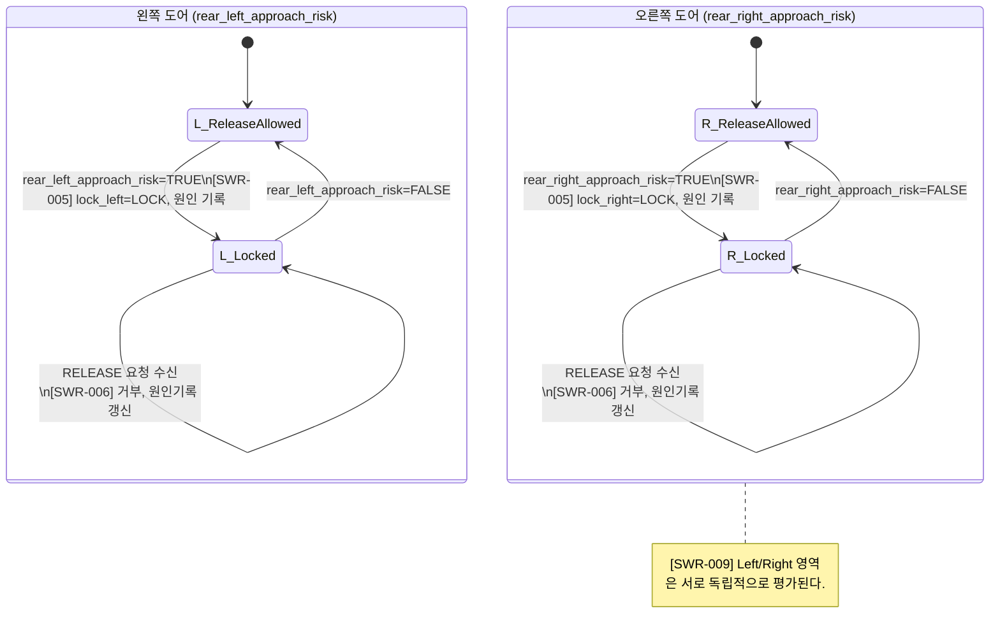
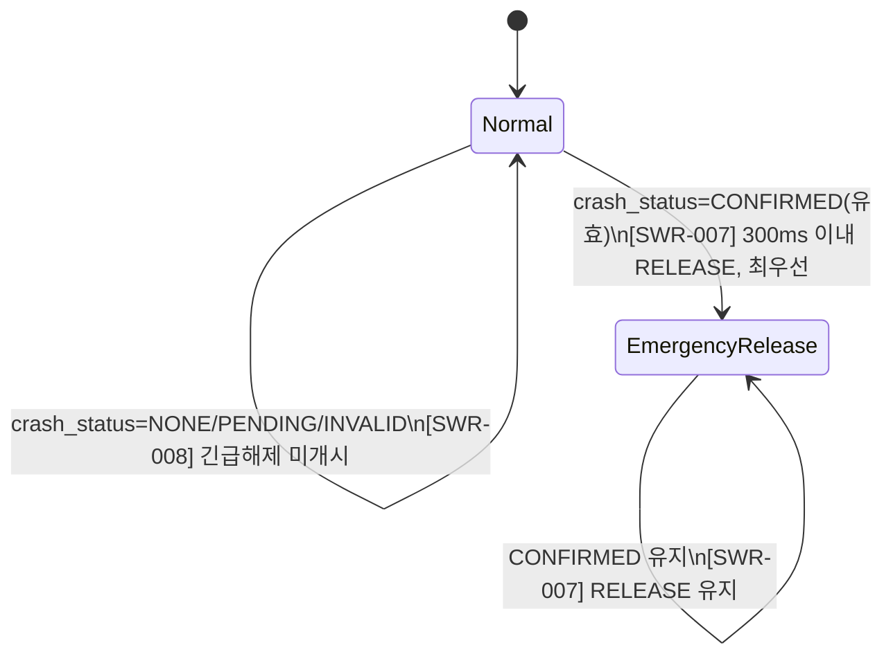
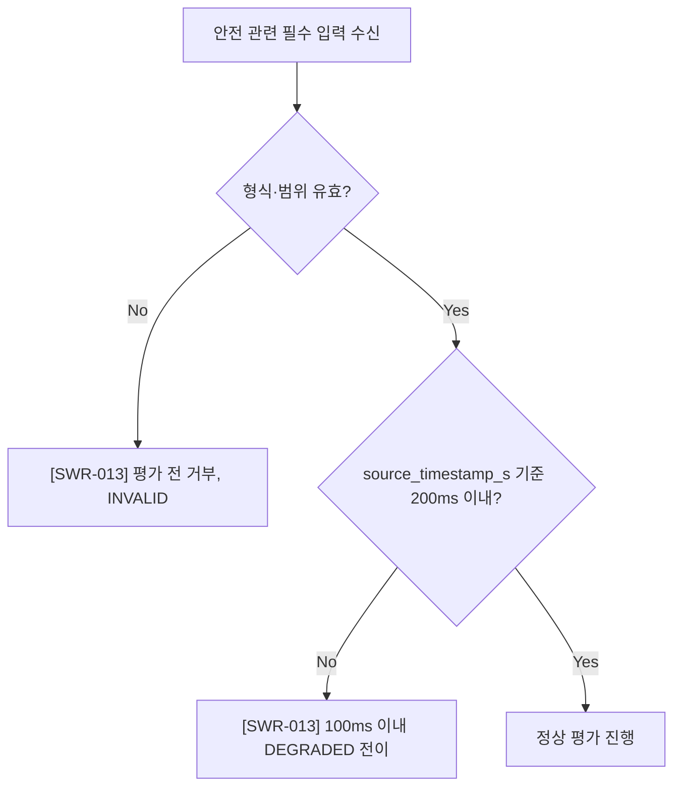
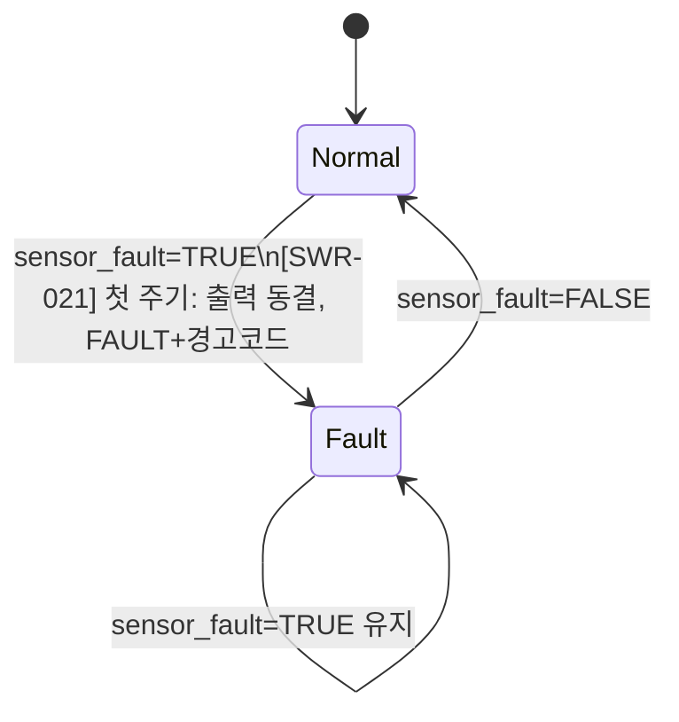

# Phase 1 SW 요구사항 분석 요약 (사람이 읽는 참고본)

> 공식 산출물은 `docs/requirements/VJ-SWR-001_SW_요구사항_명세서.docx` (TPL-SWE1-001 기반)이다. 이 마크다운은 GitHub PR 리뷰에서 docx 바이너리 diff 대신 참고할 용도로 작성했으며, 내용은 docx와 동일해야 한다(docx가 원본).
>
> 입력: `OEM_Sample/OEM-SWR-001_OEM SW 요구사항 사양서.docx` 5절 OEM-SR-001~004 (ASIL B), 6절 OEM-IF-001/002/003/005/009, 9절 추적성 표(SWR 채번). OEM-SWR-001 원본 저작권은 Synetics에 있으며 교육 과정 내 사용만 허용된다.
>
> 상태: 초안(Draft) — 미승인(리뷰 대기). 템플릿 수령 상태: 정식 템플릿 확정 사용(TPL-SWE1-001, `.claude/skills/requirements-analyst/references/template.md`가 더 이상 임시가 아님).

## 1. 7개 SWR 항목 요약표

| ID | 원문 요구(OEM-SR-###) | 도출한 SW 요구사항 텍스트 | 수용기준 | 검증방안 |
|----|----|----|----|----|
| **SWR-005** | OEM-SR-002: "후측방 접근위험이 TRUE인 도어를 LOCK하고 해제 요청을 억제" | SW는 rear_left_approach_risk 또는 rear_right_approach_risk가 TRUE로 유효하게 수신된 도어에 대해, 해당 도어의 출력(lock_left 또는 lock_right)을 LOCK으로 설정하고 그 원인을 "후측방 접근위험"으로 기록해야 한다. | 접근위험 TRUE로 유효하게 수신된 평가주기에서 해당 출력이 LOCK이고, 원인 기록에 "후측방 접근위험"이 포함된다. | SIL 환경에서 좌/우 각각 TRUE 주입(2케이스), 출력·원인 로그 자동 비교. |
| **SWR-006** | OEM-SR-002 (재입력 처리) | SW는 rear_left_approach_risk 또는 rear_right_approach_risk가 TRUE인 동안, 해당 도어에 대해 RELEASE 요청을 반복 수신하더라도 lock_left 또는 lock_right를 LOCK으로 유지해야 하며, 요청을 거부할 때마다 원인 기록을 갱신해야 한다. | 접근위험 TRUE 유지 중 RELEASE 요청이 수신되어도 해당 출력이 LOCK으로 유지되고, 거부 사유·시각이 기록된다. | SIL 환경에서 RELEASE 요청 5회 반복 주입, 출력 유지·거부 로그 건수 자동 비교. |
| **SWR-009** | OEM-SR-002 (좌우 독립, 완전성 보완) | SW는 rear_left_approach_risk와 rear_right_approach_risk를 서로 독립적으로 평가해야 하며, 한쪽 신호의 TRUE 상태가 다른 쪽 도어의 출력에 영향을 주지 않아야 한다. | 좌/우 4가지 조합(TT/TF/FT/FF)에서 TRUE인 쪽 출력만 본 요구사항으로 LOCK 전이. (원문에 없어 완전성 확보를 위해 도출) | SIL 환경에서 4케이스(PICT 생성 가능) 실행, 좌우 출력 독립성 자동 비교. |
| **SWR-007** | OEM-SR-001: "충돌 CONFIRMED가 되면 다른 명령보다 우선하여 후석 좌우 잠금 해제" | crash_status가 CONFIRMED로 유효하게 수신되면, SW는 다른 명령보다 우선하여 lock_left와 lock_right를 RELEASE로 설정해야 한다. | 유효 충돌 입력 시 두 출력이 300ms 이내 RELEASE이고 이후 입력 주기에도 유지된다(원문 그대로). | SIL/HIL 환경에서 CONFIRMED 전이 타이밍 측정(300ms 판정), 10주기 유지 확인. |
| **SWR-008** | OEM-SR-001 (PENDING/INVALID 처리, 완전성 보완) | crash_status가 CONFIRMED가 아닌 값(NONE/PENDING/INVALID)인 동안에는 SW는 SWR-007의 긴급 해제 동작을 개시하지 않아야 하며, lock_left/lock_right는 다른 적용 가능한 요구사항이 정한 값에서 변경되지 않아야 한다. | PENDING/INVALID 평가주기에서 SWR-007 강제 RELEASE 미발생. (원문에 없어 완전성 확보를 위해 도출) | SIL 환경에서 NONE→PENDING→CONFIRMED 전이 시나리오, PENDING 구간 미트리거 확인. INVALID 값 주입도 동일 확인. |
| **SWR-013** | OEM-SR-003: "안전 관련 입력의 유효성과 freshness를 확인, 비정상 입력을 정의된 방식으로 처리" | SW는 안전 관련 필수 입력(OEM-IF-001/002/003/009)에 대해 형식·범위를 벗어나는 값을 평가 이전에 거부(INVALID)해야 하며, OEM-IF-001의 source_timestamp_s 기준 최신 수신 시각과의 차이가 200ms를 초과하면 100ms 이내 SW 상태를 DEGRADED로 전이해야 한다. | 필수 입력이 200ms 초과 갱신 없으면 100ms 이내 DEGRADED, 형식·범위 오류는 평가 전 거절(원문 그대로). | (a) 대표 형식/범위 오류 셋 주입, 즉시 거부 확인. (b) source_timestamp_s 지연 결함주입, DEGRADED 전이시간(100ms) 측정. |
| **SWR-021** | OEM-SR-004: "sensor_fault가 TRUE이면 새 명령 미적용, 직전 확정 출력 유지" | 정규화된 입력의 sensor_fault가 TRUE로 확인되면, SW는 해당 평가주기에 새 명령을 적용하지 않고 lock_left/lock_right를 직전 확정 출력 값으로 유지해야 하며, SW 상태를 FAULT로 설정하고 정의된 경고 코드를 제공해야 한다. | sensor_fault=TRUE인 첫 평가주기에 좌우 출력 유지, FAULT 상태·경고코드 제공(원문 그대로). | SIL 환경에서 sensor_fault=TRUE 단일주기 결함주입, 출력 동결·FAULT/경고코드 자동 비교. |

## 2. 다이어그램 (Mermaid, GitHub에서 렌더링됨)

### SWR-005 / SWR-006 / SWR-009 — 접근위험 도어 잠금 상태기계

### SWR-007 / SWR-008 — 충돌 상태 긴급해제 중재

### SWR-013 — 입력 유효성/freshness 게이트

### SWR-021 — 센서 결함 시 직전 출력 유지

## 3. Use Case 명세서 작성 여부 — 생략 결정 및 사유

이번 4개 OEM 요구사항(및 파생 7개 SWR)에 대해 `TPL-SWE1-002 Use Case 명세서`는 **작성하지 않았다**. 사유:

- 이 요구사항들은 "액터가 시스템에 요청하고 시스템이 응답하는" 상호작용형 유스케이스가 아니라, 차량 버스로부터 수신한 상태 신호(crash_status, approach_risk, sensor_fault, source_timestamp_s)에 SW가 자율적으로 반응하는 **순수 안전 감시/제어 로직**이다. 사람 또는 외부 액터가 목적을 갖고 개시하는 흐름이 없고, 기본/대안/예외 흐름이라는 Use Case 문서 구조(4.2~4.6절)로 표현할 유의미한 사용자 시나리오가 없다.
- `uml-sysml-notation.md`의 다이어그램 선택 기준표에서도 "모드/상태 전이 기반 동작(특히 안전 관련)"은 상태기계 다이어그램을 권장하며, Use Case 다이어그램은 "액터와 시스템 간 상호작용 범위"에 적합하다고 명시한다 — 이번 항목은 후자에 해당하지 않는다.
- 따라서 FR 다이어그램화 요건은 4개의 상태기계/액티비티 다이어그램(위 2절)으로 충족했으며, Use Case 산출물(`VJ-UC-001`)은 생성하지 않았다.

## 4. 분석 결과와 가정 — 미결정 사항 (docx 8절과 동일)

1. **우선순위 중재(가장 중요)**: SWR-007(충돌 시 강제 RELEASE)과 SWR-005/006(접근위험 시 LOCK 유지)이 동시에 성립하는 입력 조합에서 상반된 출력이 요구될 수 있다. OEM 원문에 우선순위가 없어 **아키텍처/상세설계 단계에서 정의**하기로 하고 이 문서에서는 확정하지 않았다.
2. **상태 중첩**: SWR-013(DEGRADED)과 SWR-021(FAULT)이 동시에 성립할 수 있는 조합의 상태 중첩·우선순위가 원문에 없다 — 아키텍처 단계 정리 필요.
3. **freshness 판정 기준**: OEM-IF-002/003/009에 자체 timestamp가 없어, OEM-IF-001의 source_timestamp_s를 공통 기준시각으로 겸용할지 개별 heartbeat로 판정할지 미정 — 상세설계 결정 사항으로 이관.
4. **ignition_on 사용 범위**: 이번 4개 요구사항 로직에는 직접 조건으로 쓰이지 않음 — 형식 검증 대상에는 포함하되 추가 요구사항은 만들지 않음.
5. **DEGRADED 상태의 출력 처리**: SWR-021의 "직전 확정 출력 유지"는 명시되어 있으나 DEGRADED 상태의 출력 처리 방식은 원문에 없음 — 아키텍처/상세설계 단계 결정.
6. **경고 코드 체계**: SWR-021의 경고 코드 구체 체계는 원문에 없음 — 별도 진단 요구사항(범위 밖)에서 정의 가정.

## 5. 요약 통계

- 총 요구사항 수: 7개 (SWR-005, SWR-006, SWR-007, SWR-008, SWR-009, SWR-013, SWR-021)
- FR/NFR 비율: FR 7 / NFR 0 (Phase 1에는 독립 NFR 없음 — 타이밍 기준은 각 SWR 수용기준에 내재, 7절 참고)
- 다이어그램 첨부: 4개 (상태기계 3개 + 액티비티 1개), 모두 요구사항 ID 라벨 포함
- 추적성 커버리지: 상위추적 100%(고아 없음), 하위추적(Architecture~SWE.6)은 7건 모두 "미배정/갭" — Phase 1이 분석 단계까지만 진행하므로 정상
- 일관성 이슈: 상충 후보 2건(우선순위 중재, 상태 중첩) — 해결 확정은 다음 단계로 이관, 이 문서에서는 미결정으로 명시
- 템플릿 수령 상태: 정식 템플릿(TPL-SWE1-001/TPL-TRC-001) 확정 사용 — 임시 아님
